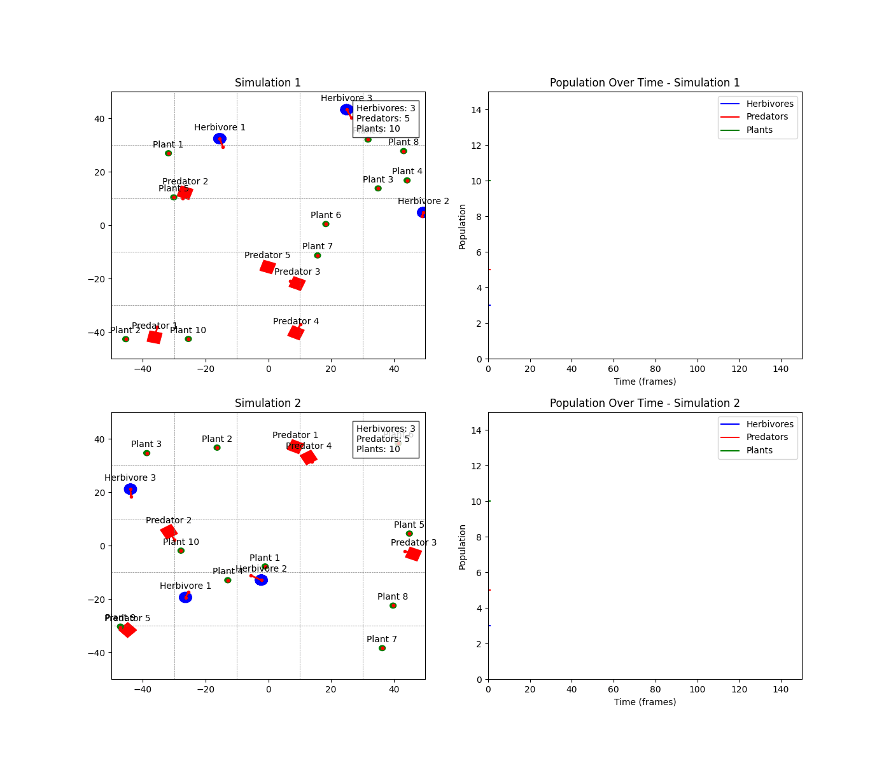

# SurvivalRL Updates

-   [**Circle and Rectangle Collision System**](#circle-and-rectangle-collision-system)

-   [**Plant, Herbivore, and Predator**](#plant-herbivore-and-predator)
-   [**Multi Simulation with Population Graph**](#multi-simulation-with-population-graph)
-   [**Debug Mode**](#debug-mode)

## Circle and Rectangle Collision System

**Date: 2025.03.03.** - [**Commit Link**](https://github.com/kar7mp5/SurvivalRL/commit/27968305b239fde20802f6942b82fc8bffc1c955)

**Added Functions:**

-   Add Game Object
-   Added Objects
    -   Circle obj
    -   Rectangle obj

## Plant, Herbivore, and Predator

**Date: 2025.03.03** - [**Commit Link**](https://github.com/kar7mp5/SurvivalRL/commit/f1abcdb2f6f2a5673954d47ea583f328184bf76e)

**Improvement:**

-   Improve OOC
-   Improve rectangle collision algorithm (AABB -> GJK)
-   Add Plant, Herbivore, and Predator (but these objects have no functions).

## Multi Simulation with Population Graph

**Date: 2025.03.03** - [**Commit Link**](https://github.com/kar7mp5/SurvivalRL/commit/a57ec7a8435e497bd419ead2e381c5bc6b5a60f0)

-   Add multi simulations and plots.
-   Duplication test.

## Debug Mode

**Date: 2025.03.03** - [**Commit Link**](https://github.com/kar7mp5/SurvivalRL/commit/e69b6ca8c2296b0b65660438d7e64ca53ecedcfa)

-   Add energy but it has no functions.
-   Add Debug Mode.

