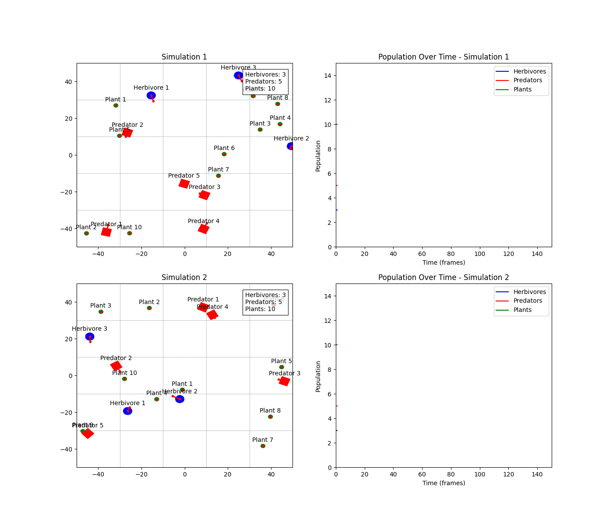
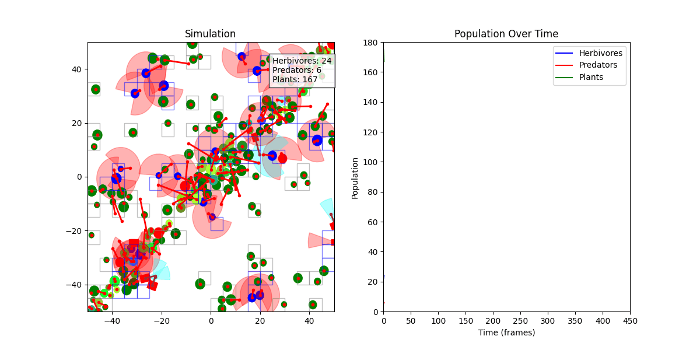
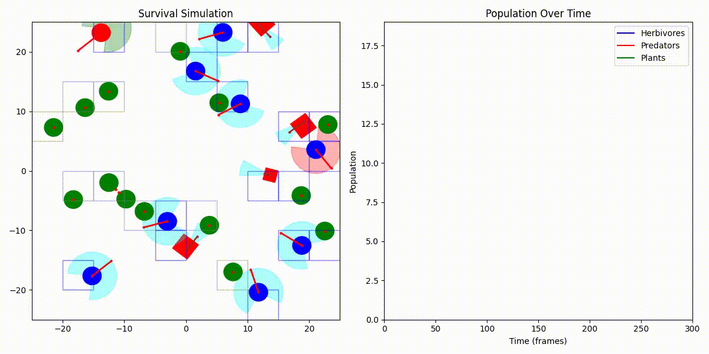
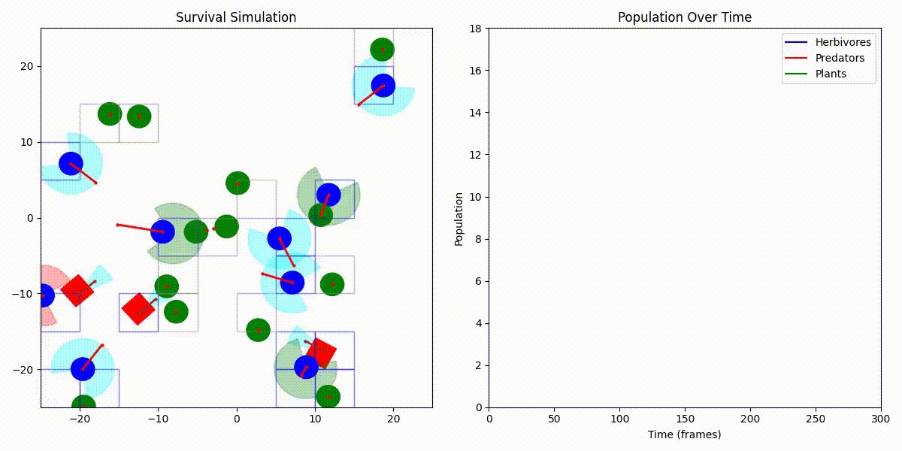
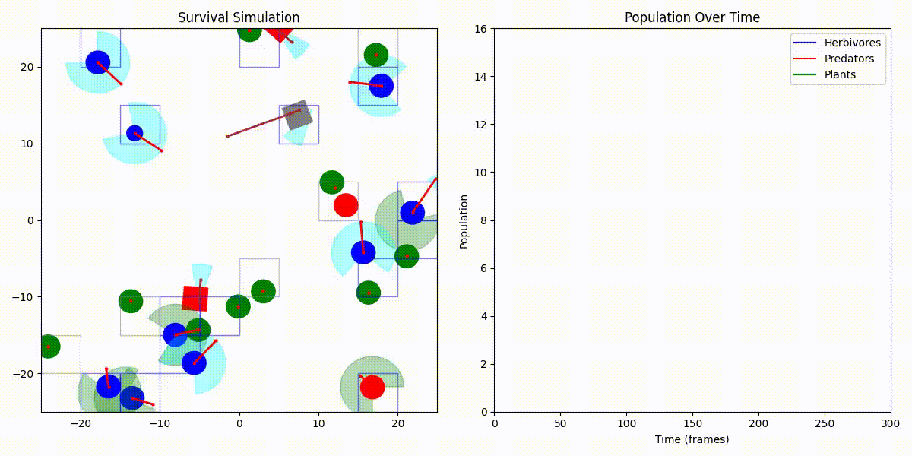

# SurvivalRL Updates

1.  [**Circle and Rectangle Collision System**](#circle-and-rectangle-collision-system)
2.  [**Plant, Herbivore, and Predator**](#plant-herbivore-and-predator)
3.  [**Multi Simulation with Population Graph**](#multi-simulation-with-population-graph)
4.  [**Debug Mode**](#debug-mode)
5.  [**POV Detector**](#pov-detector)
6.  [**Spatial Hash Grid (Collision)**](#spatial-hash-grid-collision)
7.  [**Apply Reinforcement Learning**](#apply-reinforcement-learning)
8.  [**Fix Reinforcement Learning and Enhance model**](#fix-reinforcement-learning-and-enhance-model)

## Circle and Rectangle Collision System

**Date: 2025.03.03.** - [**Commit Link**](https://github.com/br4c3/SurvivalRL/commit/27968305b239fde20802f6942b82fc8bffc1c955)

**Added Functions:**

-   Add Game Object
-   Added Objects
    -   Circle obj
    -   Rectangle obj

## Plant, Herbivore, and Predator

**Date: 2025.03.03** - [**Commit Link**](https://github.com/br4c3/SurvivalRL/commit/f1abcdb2f6f2a5673954d47ea583f328184bf76e)

**Improvement:**

-   Improve OOC
-   Improve rectangle collision algorithm (AABB -> GJK)
-   Add Plant, Herbivore, and Predator (but these objects have no functions).

## Multi Simulation with Population Graph

**Date: 2025.03.03** - [**Commit Link**](https://github.com/br4c3/SurvivalRL/commit/a57ec7a8435e497bd419ead2e381c5bc6b5a60f0)

-   Add multi simulations and plots.
-   Duplication test.

## Debug Mode

**Date: 2025.03.03** - [**Commit Link**](https://github.com/br4c3/SurvivalRL/commit/e69b6ca8c2296b0b65660438d7e64ca53ecedcfa)

-   Add energy but it has no functions.
-   Add Debug Mode.

## FOV Detector

**Date: 2025.03.05.** - [**Commit Link**](https://github.com/br4c3/SurvivalRL/commit/03d710c4adadf3cd7c79e6b35f0317f1845243c7)

-   Add individual debug mode.
-   Add FOV detector.

## Spatial Hash Grid (Collision)

**Date: 2025.03.13.** - [**Commit Link**](https://github.com/br4c3/SurvivalRL/commit/db75f806d56dd9e86ce1deced4907db306a688ee)

-   At first, I tried using a QuadTree for object collision detection. It worked well for collisions, but I stopped using it due to issues with FOV detection. So, I switched to a Spatial Hash Grid instead.
-   I set the predator object's size to change based on its energy level.

## Apply Reinforcement Learning

**Date: 2025.03.18.** - [**Commit Link**](https://github.com/br4c3/SurvivalRL/commit/74c93b772fb0bd8417c9d17fb9bec167510b42a8)

-   Add Reinforcement Learning train and infercence.

### Train

### Inference

## Fix Reinforcement Learning and Enhance model

**Date: 2025.04.11.** - [**Commit Link**](https://github.com/br4c3/SurvivalRL/commit/637aaac1c92f931b7e406c621b659c70c8b17f4c)

### 1. Reward logic refactored into agents

-   `compute_reward()` moved to `Predator` and `Herbivore` classes
-   Each agent now computes its own reward
-   `SurvivalEnv` only collects the results

### 2. FOV-based visualization added

-   `draw_fov(detection_type)` added
-   FOV color changes based on intent:
    -   `"approach"` → green
    -   `"avoid"` → red
    -   `None` → cyan

### 3. Herbivore reward shaping improved

-   Strong penalty for close predator proximity (`-30`)
-   Bonus for maintaining distance (`+10`)
-   Plant detection (`+3`) and approach (`+5`)
-   Reproduction reward (`+5`)

### 4. Predator target behavior improved

-   Prioritizes herbivores, then plants
-   Reward for plant detection (`+0.2`) and approach (`+2`)
-   Penalty for missing nearby plant (`-5`)
-   Reproduction reward (`+5`)

### Herbivore Train

### Predator Train

### Inference

